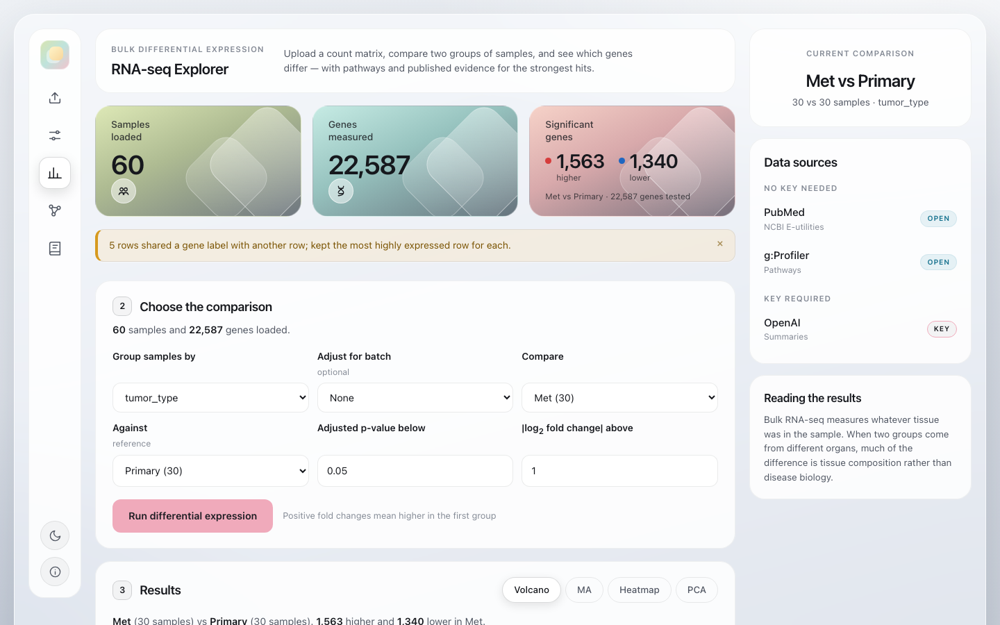
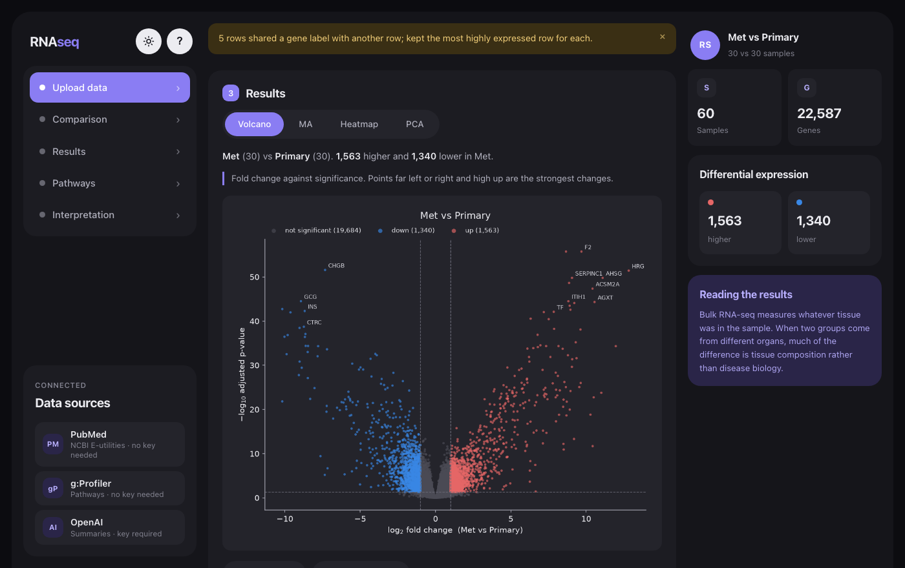
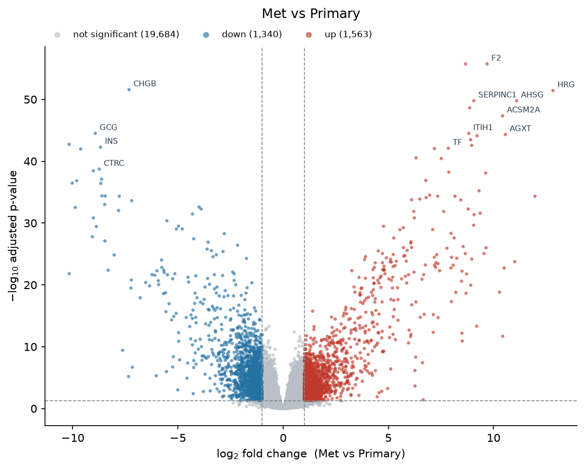
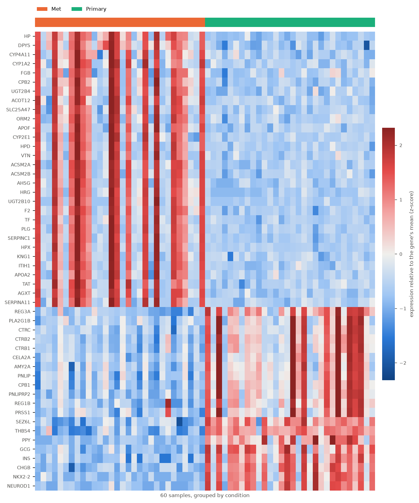
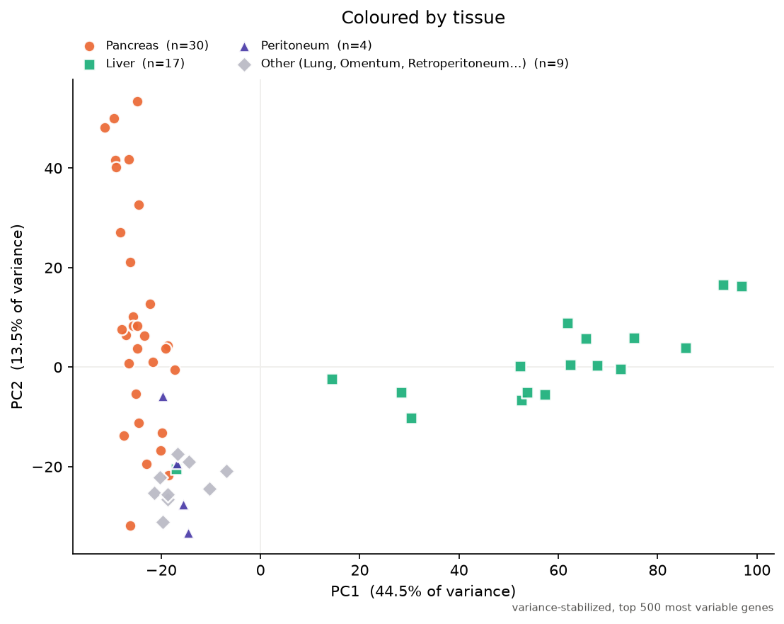
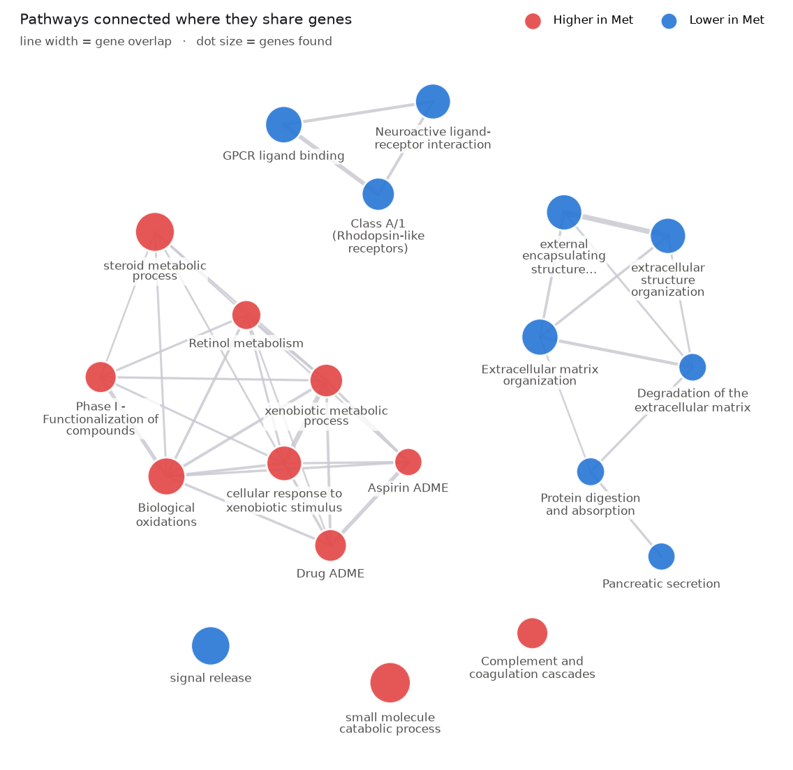

# Bulk RNA-seq Explorer

A web app that takes a bulk RNA-seq count matrix, compares two groups of samples, and explains the
result. It runs the standard differential expression analysis, draws a volcano plot, finds the
pathways over-represented among the significant genes, then looks up each of the strongest genes in
PubMed and asks a language model to interpret the findings using only the pathways and abstracts it
retrieved.

The goal is to let a wet-lab researcher go from a count matrix to an annotated, literature-backed
gene list without writing any code.













## How the APIs are called

The app calls three public APIs with the `requests` and `openai` Python modules. For each of the top
differentially expressed genes, [`rnaseq/ncbi.py`](rnaseq/ncbi.py) sends an **NCBI E-utilities**
`esearch` request (`db=pubmed`, `term="<gene>"[Title/Abstract] AND (<disease term>)`, `retmax=3`,
`sort=pub_date`, `retmode=json`) and gets back JSON containing a list of PubMed ID strings; those IDs
are then passed to a single batched `efetch` request (`rettype=abstract`, `retmode=xml`) whose XML
response is parsed into title, abstract, journal and year fields. Separately,
[`rnaseq/enrichment.py`](rnaseq/enrichment.py) POSTs the significant gene symbols as JSON to the
**g:Profiler** `gost/profile` endpoint (`organism=hsapiens`, the tested genes as `background`,
`sources=["GO:BP","KEGG","REAC"]`), which returns JSON describing each enriched pathway with a
corrected p-value and term sizes. Those abstracts and pathways, together with each gene's symbol,
log2 fold change and adjusted p-value, are assembled into one text prompt in
[`rnaseq/llm.py`](rnaseq/llm.py) and sent to the **OpenAI Responses API** (`model=gpt-5-mini`,
`max_output_tokens=4000`, `reasoning={"effort": "low"}`), which returns a JSON response whose
`output_text` field holds the Markdown summary displayed in the browser. All three are called only
from the Flask backend, never from the browser, so the API key is never exposed to users.

## API keys

Two keys, one required and one optional. **Never commit either one** — `.env` is listed in
`.gitignore` and must stay that way.

| Key | Required? | Where to get it | Cost |
|---|---|---|---|
| `OPENAI_API_KEY` | Yes, for the AI summary | [platform.openai.com/api-keys](https://platform.openai.com/api-keys) | About $0.007 per analysis |
| `NCBI_API_KEY` | No | [NCBI account settings](https://www.ncbi.nlm.nih.gov/account/settings/) | Free |

g:Profiler needs no key or account at all, so pathway enrichment works out of the box.

An OpenAI key needs its own credit balance: **API usage is billed separately from a ChatGPT
subscription**, so a paid ChatGPT plan does not include it. Add a few dollars of credit under
Billing, and set a monthly spend limit while you are there. The NCBI key is optional and only raises
the PubMed rate limit from 3 to 10 requests per second.

To provide them, copy the example file and paste your keys into the copy:

```bash
cp .env.example .env      # then edit .env and paste the keys after the = signs
```

The app reads `.env` at startup with `python-dotenv`. Alternatively you can export the variables in
your shell, or paste an OpenAI key into the optional field in the web interface, which keeps it in
memory for that request only.

## Running it

Requires Python 3.11 or newer (tested on 3.14).

```bash
git clone https://github.com/afphelps-wq/15113-api-project.git
cd 15113-api-project

python3 -m venv .venv
source .venv/bin/activate          # Windows: .venv\Scripts\activate
pip install -r requirements.txt

cp .env.example .env               # paste your OpenAI key into .env

python app.py                      # then open http://127.0.0.1:5000
```

**Use `127.0.0.1`, not `localhost`.** On macOS, AirPlay Receiver also listens on port 5000, so
`http://localhost:5000` returns a blank "403 Forbidden" page from AirPlay instead of this app. If
that happens, either use `http://127.0.0.1:5000` or turn AirPlay Receiver off in System Settings →
General → AirDrop & Handoff.

In the browser, upload `demo_data/demo_counts.csv` and `demo_data/demo_metadata.csv`, group the
samples by `tumor_type`, and compare `Met` against `Primary`. On a recent laptop the analysis takes
about 15 seconds, the pathway step about 6 seconds, and the literature and AI step about 20 seconds.
The full 289-sample series takes about 18 seconds to analyse.

To run the tests: `python -m pytest`

To click through every feature in a real browser (optional; needs `pip install playwright`), start
the app and run `python scripts/browser_check.py`. It drives your installed Chrome through upload,
all four result figures, the pathway views, navigation and the theme toggle, and reports anything
that fails or logs an error. Add `--ai` to include the OpenAI step.

## The demo dataset

`demo_data/` holds 60 samples (30 primary tumours, 30 metastases) and 22,592 genes, taken from
[GEO series GSE205154](https://www.ncbi.nlm.nih.gov/geo/query/acc.cgi?acc=GSE205154) — bulk RNA-seq
of 289 formalin-fixed pancreatic ductal adenocarcinoma tumours. The full series is too large for
GitHub, so [`scripts/make_demo_data.py`](scripts/make_demo_data.py) documents exactly how the subset
was derived and will rebuild it if you download the original files.

This comparison doubles as a correctness check. Metastases should lose pancreas-specific genes and
gain liver and plasma genes, simply because of the tissue each sample was cut from — and that is
exactly what the app reports (GCG, INS, CTRC and CPB1 down; HP, HPX, SERPINC1, F2 and AHSG up).
Two tests in `tests/test_pipeline.py` assert this, so a regression that broke the statistics would
fail the suite. The pathway step tells the same story independently: drug metabolism, biological
oxidations and complement/coagulation cascades come up (liver functions), while pancreatic secretion
and protein digestion go down.

It is also a useful warning. A bulk RNA-seq comparison between samples from **different organs**
largely measures tissue composition, not tumour biology. The PCA shows this most directly: coloured
by tissue, the first component (44.5% of variance) separates the **liver** metastases from
everything else, while lung, peritoneal and omental metastases sit alongside the pancreatic
primaries. The "Met vs Primary" difference is mostly the liver samples. The interface says so, and the model is
instructed to raise it — which it does unprompted in the generated summary.

## What the app does

1. **Upload** a count matrix (genes in rows, samples in columns) and a sample metadata table.
   Estimated counts with decimals are rounded, genes are labelled by symbol where one exists,
   duplicate labels are collapsed, and samples missing from either file are reported and dropped.
2. **Compare** any two groups from a metadata column, optionally adjusting for a batch column.
   Differential expression runs through [PyDESeq2](https://pydeseq2.readthedocs.io/), a Python port
   of DESeq2, after filtering genes with too few reads to test.
3. **Review** the ranked gene table and four figures, each downloadable as PNG:
   - **Volcano plot** — log2 fold change against −log10 adjusted p-value, to pick out the strongest
     up- and down-regulated genes.
   - **MA plot** — mean expression against log2 fold change, with a running median, to check for
     intensity-dependent bias. A healthy result stays centred on zero at every expression level.
   - **Heatmap** — the top genes z-scored across samples and clustered, to show whether the groups
     separate consistently and which samples disagree with their group.
   - **PCA** — the samples on their first two principal components, from variance-stabilized counts
     of the 500 most variable genes (as in DESeq2's `plotPCA`). Colour it by any metadata column to
     see what really drives the variation.
4. **Find pathways** over-represented among the significant genes, using g:Profiler (GO biological
   process, KEGG and Reactome), tested against the genes the experiment actually measured. Results
   can be read as a **dot plot**, a **bar plot**, an **enrichment network** or a table, following
   the conventions of [clusterProfiler](https://bioconductor.org/packages/clusterProfiler/)'s
   `enrichplot` so the figures are familiar from the literature.
5. **Interpret** the top genes with PubMed abstracts and an AI summary that cites the PMIDs it used.

**Light and dark mode.** The sun/moon button at the bottom of the icon rail switches themes, and the choice is
remembered; with no choice made, the app follows your operating system. The figures are redrawn in
a dark palette too, rather than left as white rectangles — each palette has its own colour steps,
checked for colour-blind separation and contrast against its own background. Downloaded figures are
always light, since they usually end up in a paper or slide deck.

## Privacy

Uploaded counts and sample names stay on your own machine and are never sent to an external
service. They are held in the server process, not saved: the only thing that touches the disk is the
temporary file the web server (Werkzeug) spools an upload larger than 500 KB into while it is being
received, which it deletes as soon as the request finishes. PubMed and g:Profiler receive only gene
symbols; OpenAI additionally receives fold changes, adjusted p-values, the enriched pathway names
and the retrieved abstracts. `build_payload()` in `rnaseq/llm.py` is the single place the OpenAI
request is assembled, and `tests/test_literature.py` asserts that sample identifiers and raw counts
cannot appear in it.

## Limitations

- **Bulk only.** Single-cell or spatial data will not work here.
- **Raw counts only.** Normalized values (TPM, FPKM, CPM) break DESeq2's model; the app warns when
  the input looks normalized, but cannot always detect it.
- **Two groups at a time**, with an optional batch covariate. No interaction terms or multi-factor
  designs.
- **Enrichment figures are drawn in Python**, matching clusterProfiler's visual grammar rather than
  calling R. That keeps installation to `pip install -r requirements.txt`; it also means the
  statistics come from g:Profiler, not from clusterProfiler's own enrichment.
- **Human-focused.** Pathway enrichment has a human/mouse selector, and the PubMed search uses gene
  symbols as written, so mouse data should work — but it has only been tested on human data.
- **One analysis at a time, in one browser tab.** The app keeps the last few uploads in memory and
  has no accounts; it is meant to be run locally by one person. Running a second comparison replaces
  the first, and the Pathways panel keeps showing the previous comparison's results until you press
  **Find enriched pathways** again.
- **It trusts the files you give it.** Group names from your metadata are shown as written, so only
  open metadata files you trust.
- **Development server.** `python app.py` runs Flask's development server, which is right for local
  use but should not be exposed to a network.
- **The AI summary is a starting point, not a result.** It reads only the abstracts retrieved for
  that run, automated PubMed searches return some irrelevant papers (short symbols like `HP` and
  `TF` collide with common abbreviations), and every claim needs checking against the linked
  sources before it goes anywhere near a manuscript.

## Project layout

```
app.py                  Flask routes (upload, analyze, enrich, interpret, downloads)
rnaseq/
  io_utils.py           parsing, validation, gene labels, sample alignment
  analysis.py           gene filtering and the PyDESeq2 comparison
  plots.py              volcano, MA, heatmap, PCA and the enrichment figures, as PNG
  enrichment.py         g:Profiler pathway and GO enrichment (no key needed)
  ncbi.py               PubMed esearch/efetch client and rate limiter
  llm.py                prompt construction and the OpenAI call
templates/, static/     single-page interface, plain JavaScript
demo_data/              committed 60-sample subset of GSE205154
scripts/                how the demo subset was built; an optional browser check
tests/                  128 tests, including a biology sanity check
```

[`WALKTHROUGH.md`](WALKTHROUGH.md) explains how the pieces fit together and why the trickier parts
work the way they do. [`prompt_log.md`](prompt_log.md) records the AI tools and prompts used to build
it.

## Credits

Built for 15-113 by Anabella Phelps. Data from GEO series GSE205154. Statistics by PyDESeq2,
literature from NCBI E-utilities, summaries from the OpenAI API.
